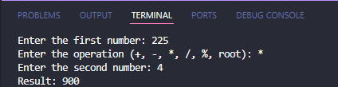
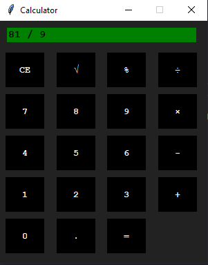

# Modular Calculator using Python and Tkinter

## A Simple Modular Calculator using Python (CLI) and Tkinter (GUI)

This calculator is implemented using Python and it's purpose is to demonstrate how to create a simple modular calculator using Python. The calculator is availible in both CLI (Command Line Interface) and GUI (Graphical User Interface) versions and as this is a modular calculator, it can be easily extended to support more arithmetic operations. Right now, the calculator supports the following arithmetic operations:

- Addition
- Subtraction
- Multiplication
- Division
- Percentage
- Square root

## Calculator Screenshot (GUI and CLI Versions)





## How to use the calculator in CLI mode

To use the calculator in CLI mode, follow the steps below:

1. Clone the repository
2. Open the terminal and navigate to the directory where the repository is cloned
3. Run the following command: ``` python cli_calculator.py ```
4. Follow the on-screen instructions to perform the desired arithmetic operation

## How to use the calculator in GUI mode

To use the calculator in GUI mode, follow the steps below:

1. Clone the repository
2. Open the terminal and navigate to the directory where the repository is cloned
3. Run the following command: ``` python gui_calculator.py ```
4. A GUI window will open with the calculator
5. Click on the buttons to perform the desired arithmetic operation

## How to extend the calculator (CLI Only)

The CLI calculator can be easily extended to support more arithmetic operations. To add a new operation, follow the steps below:

1. create a new function in the ```operations``` module that performs the desired arithmetic operation
2. open the ```__init__.py``` file in the ```operations``` directory and import the new function
3. Add the function to the ```operations``` dictionary in the ```cli_calculator.py``` file
4. Add the new operation to the list of operations in the ```user_input_cli()``` function in the ```cli_calculator.py``` file
5. Run the ```cli_calculator.py``` file and test the new operation

## Found a bug?

If you find a bug in the calculator, please create a new issue in the repository and I will try to fix it as soon as possible.

## Known Issues (or Limitations that i didn't have time to fix yet =D)

Below you can find a list of known issues with the calculator (mostly GUI):

- The GUI calculator does not support keyboard input
- The GUI calculator has some layout issues on smaller screens
- The GUI calculator cannot handle multiple operations in a single expression
- The GUI calculator does not support the backspace key
- The CLI calculator have not been tested on every possible edge case

## Like the calculator?

If you like the calculator, please give it a star and share it with your friends. If you have any suggestions for improvements, feel free to create a new issue or submit a pull request.
